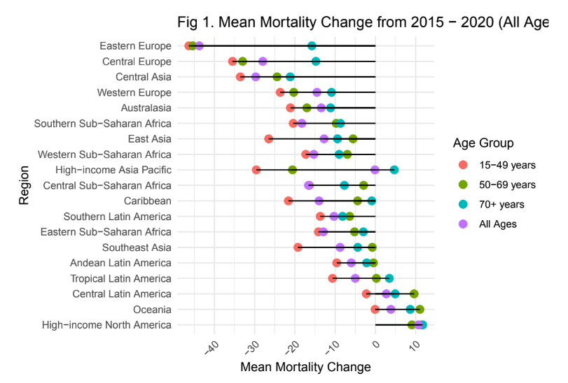
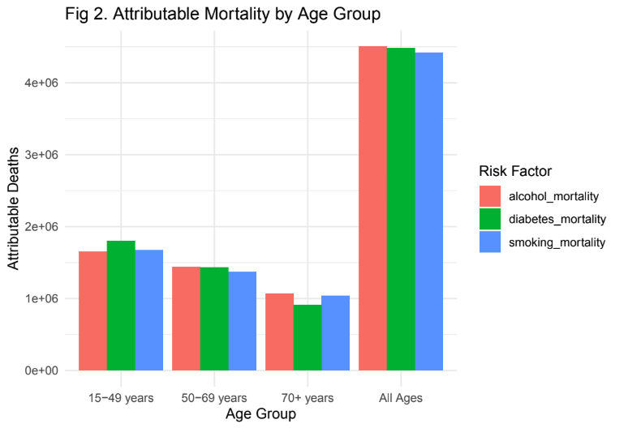
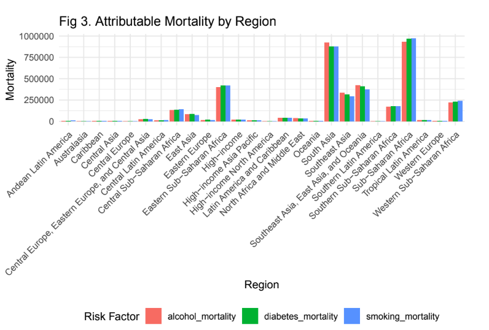
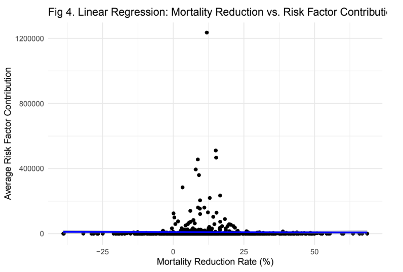

## Overview

This class covered the basics of programming including **communicating with machines**, writing **clean code** and **collaborative programming**. More specifically in this class I learned *git* and *R* and built a **codebase** to deal with a series of tasks focused on **data manipulation**. In this course I used *R* to **manipulate data** and create **simple models** and **analysis** as well as understanding, recognizing and writing clean code for readability and extendability. Finally, I also tested, debugged and documented R functions that I wrote. 

---

## Final Project for HMS520 Data Analysis for (GBD 2021) Tuberculosis Estimates 1990-2021

Collaborator: Ye Htet Naing MD, MPH

**Background**

This project explored the **global mortality trends** and **risk factor** contributions to **tuberculosis (TB)** between 2015 and 2019 using data from the **Institute for Health Metrics and Evaluation (IHME) Global Burden of Disease 2021 (GBD 2021)** study. Access to the data can be found [here](https://ghdx.healthdata.org/record/ihme-data/gbd-2021-tuberculosis-incidence-mortality-1990-2021). In support of the **World Health Organization's** End TB Strategy, which targeted a **35% reduction** in TB mortality and a **20% reduction** in TB incidence by 2020, we examined whether these goals were achieved across different regions and age groups, and how much modifiable risk factors like **smoking**, **alcohol use**, and **diabetes** contributed to **TB mortality**. 

**Key Objectives** 

Using GBD data we aimed to answer the following key questions: 

1. How have **mortality rates** changed from 2015 to 2020 across different age groups and regions?

2. What is the **relative contribution** of different **risk factors** (e.g., smoking, alcohol use, and diabetes) to TB mortality in 2015 and 2020?

3. Do regions or age groups with **higher reductions** in TB mortality also show lower contributions of risk factors?

**Data and Methods** 

Our analysis included: 

- **Preprocessing and Cleaning**: Filtering relevant columns, checking for missing data and creating derived variables 
- **Trend Analysis**: Calculated percent change in mortality by region and age groups (2015-2020)
- **Risk Factor Analysis**: Assessed proportion of TB mortality attributable to each risk factor 
- **Regression Analysis**: Explored associations between reductions in mortality and changes in attributable risks

**Key Visualizations**

**Figure 1: Mean Mortality Change from 2015 - 2020 (All Ages)**

**Figure 2. Attributable Mortality by Age Group**

**Figure 3. Attributable Mortality by Region**

**Figure 4. Linear Regression: Mortality Reduction vs Risk Factor Contribution**

**Findings and Interpretation**

- We found that TB mortality has **declined** globally between 2015 and 2020 with varying degrees of success by **region**. Some regions exceeded the end TB targets while others lagged behind 

- **Older age groups** (50-69 and 70+) had higher rates of TB mortality, both in general and due to risk factors 

- **Smoking** was the leading attributable risk factor for TB mortality across most age group and regions, followed by alcohol and diabetes 

- Regions with **higher reductions** in TB mortality often had **lower attributable mortality** from modifiable risks, suggesting successful implementation of broader public health interventions. 

**Conclusion**

Our analysis shows the importance of **age and region specific TB strategies** and highlights the ongoing role of **modifiable risk factors in driving TB mortality**. These insights can inform **tailored public health interventions** and help guide progress towards **TB elimination** goals worldwide. 

[Download Project Report (PDF)](hms_520_tb_final.pdf)

[GitHub Code Repository](https://github.com/smwhikeh/HMS_520_Final_Project_TB)