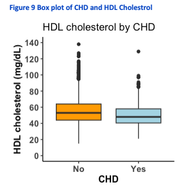
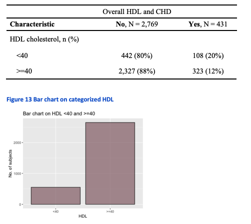

## Overview

This class covered the presentation of the principles and methods of **data description** and elementary **parametric** and **nonparametric** statistical analysis. 

Examples were drawn from biomedical literature and real data sets were analyzed after a brief introduction to the use of standard statistical computer packages in `RStudio`. 

Statistical Techniques covered included **description of samples**, comparison of **two sample means** and **proportions**, **simple linear regression** and **correlation**.

---

## Cardiovascular Health Study: Statistical Data Analysis Plan (Part 1)

### Exploring the Associations between HDL Cholesterol, Family History of Heart Attack, and Coronary Heart Disease in Adults Aged 65+ 

Collaborators: Tessa Fujisaki MPH, Thania Solar M.D., MPH, and Sian Siam MPH.

This project investigated how high-density lipoprotein (HDL) cholesterol levels and family history of heart attack and modifiers related to the incidence of coronary heart disease (CHD) in older adults leveraging data from the Cardiovascular Health Study (CHS) dataset `chd3200.csv`, a large-scale longitudinal study focused on adults aged 65 and above.

Our team developed a detailed **statistical and inferential analysis plan** to examine key risk factors for CHD in an aging population. Using 6 years of follow up data, we explored whether family history of heart attack acts as an effect modifier in the relationship between HDL and CHD. 

**Key Objectives:** 

- Determine which variables there is a **statistically significant association** with CHD but in particular, between HDL cholesterol levels and the incident of CHD. 
- Assess whether family history of heart attack modifies this association 
- Explore other variables such as age, smoking status, alcohol use and insulin levels for potential associations with CHD. 

**Proposed Methodology:**

- **Descriptive analysis** summarized distributions of continuous and categorical variables
- **Bivariate analysis** examined relationships between CHD and individual predictors using cross-tabulations and summary statistics 
- **Inferential analysis** included proposal of t-test and chi-square test to asses the associations and interaction effects with a significance threshold of a = 0.05. 
- Addressed **data cleaning** strategies including handling missing values, detecting outliers and identifying potential confounders and effect modifiers (ex - smoking status and age).

---

## Cardiovascular Health Study: Statistical Data Report (Part 2)

**Statistical data analysis** was conducted in **Rstudio (v2023.06.2+561)** using packages such as `dyplr`, `ggplot2`, `e1071`, `flextable`, `gtsummary` and `tidyr`.

**Data Analysis**

- **Descriptive Statistics**
    - **Summary table** for continous variables (ex - age, HDL, insulin, alcohol) and categorical variables (CHD, FHHA, smoking status) was generated to examine distributions, skewness and central tendencies
- **Data Visualization**
    - Creation of **histograms** and **boxplot** to explore continuous variable distribution and bar chart to visualize categorical data and bivariate relationships
- **Bivariate Analysis**
    - **T-test** and **chi-square test** performed to compare HDL levels, age, alcohol intake, insulin, smoking and FFHHA by CHD status 
    - Individuals **stratified** by HDL levels (<40 mg/dL vs >40 mg/dL) and FHHA to assess if FHHA modifies HDL-CHD relationship 
- **Effect Modification Testing**
    - We examined the **stratified frequency** of CHD across HDL levels, separately for those with and without FHHA 
        - Difference in frequencies suggested effect modification 

**Results** 

- **Descriptive Findings** 
    - **Mean HDL** was lower in individuals with CHD (51mg/dL)
    - Serum insulin and alcohol consumption was higher among individuals with CHD 
    - 13.5% of participants had CHD, 30.8% reported FHHA and 11.8% were current smokers 
- **Inferential Findings**
    - Two sample **t-test** showed statistically significant difference in HDL levels between those with and without CHD (p < 0.001>)
    - FHHA **modified the relationship** between HDL and cHD 
        - Among those with HDL <40mg/dL, 25% of individuals with FHHA had CHD compared to 17% without FHHA 
        - Among those with HDL >40mg/dL, 15% of individuals with FHHA had CHD compared to 11% without FHHA.







**Conclusion**

This project found that **lower HDL cholesterol** levels are **significantly associated** with **increased CHD risk** in older adults and that **family history of heart attack** modifies this relationship. Therefore this shows the importance of early lipid screening, family history assessment and lifestyle interventions to prevent CHD in aging populations. 

[Download Full Project Report (PDF)](dap.pdf)

[GitHub Code Repository](https://github.com/smwhikeh/biost_511_dap)


<!-- [Hugo Blox Builder](https://hugoblox.com) is designed to give technical content creators a seamless experience. You can focus on the content and the Hugo Blox Builder which this template is built upon handles the rest.

**Embed videos, podcasts, code, LaTeX math, and even test students!**

On this page, you'll find some examples of the types of technical content that can be rendered with Hugo Blox.

## Video

Teach your course by sharing videos with your students. Choose from one of the following approaches:



**Youtube**:

    

**Bilibili**:

    

**Video file**

Videos may be added to a page by either placing them in your `assets/media/` media library or in your [page's folder](https://gohugo.io/content-management/page-bundles/), and then embedding them with the _video_ shortcode:

    

## Podcast

You can add a podcast or music to a page by placing the MP3 file in the page's folder or the media library folder and then embedding the audio on your page with the _audio_ shortcode:

    

Try it out:



## Test students

Provide a simple yet fun self-assessment by revealing the solutions to challenges with the `spoiler` shortcode:

```markdown

You found me!

```

renders as

 You found me 🎉 

## Math

Hugo Blox Builder supports a Markdown extension for $\LaTeX$ math. You can enable this feature by toggling the `math` option in your `config/_default/params.yaml` file.

To render _inline_ or _block_ math, wrap your LaTeX math with `$...$` or `$$...$$`, respectively.

{}
We wrap the LaTeX math in the Hugo Blox _math_ shortcode to prevent Hugo rendering our math as Markdown.
{}

Example **math block**:

```latex

$$
\gamma_{n} = \frac{ \left | \left (\mathbf x_{n} - \mathbf x_{n-1} \right )^T \left [\nabla F (\mathbf x_{n}) - \nabla F (\mathbf x_{n-1}) \right ] \right |}{\left \|\nabla F(\mathbf{x}_{n}) - \nabla F(\mathbf{x}_{n-1}) \right \|^2}
$$

```

renders as


$$\gamma_{n} = \frac{ \left | \left (\mathbf x_{n} - \mathbf x_{n-1} \right )^T \left [\nabla F (\mathbf x_{n}) - \nabla F (\mathbf x_{n-1}) \right ] \right |}{\left \|\nabla F(\mathbf{x}_{n}) - \nabla F(\mathbf{x}_{n-1}) \right \|^2}$$


Example **inline math** `$\nabla F(\mathbf{x}_{n})$` renders as $\nabla F(\mathbf{x}_{n})$.

Example **multi-line math** using the math linebreak (`\\`):

```latex

$$f(k;p_{0}^{*}) = \begin{cases}p_{0}^{*} & \text{if }k=1, \\
1-p_{0}^{*} & \text{if }k=0.\end{cases}$$

```

renders as



$$
f(k;p_{0}^{*}) = \begin{cases}p_{0}^{*} & \text{if }k=1, \\
1-p_{0}^{*} & \text{if }k=0.\end{cases}
$$



## Code

Hugo Blox Builder utilises Hugo's Markdown extension for highlighting code syntax. The code theme can be selected in the `config/_default/params.yaml` file.


    ```python
    import pandas as pd
    data = pd.read_csv("data.csv")
    data.head()
    ```

renders as

```python
import pandas as pd
data = pd.read_csv("data.csv")
data.head()
```

## Inline Images

```go
 Python
```

renders as

 Python

## Did you find this page helpful? Consider sharing it 🙌
-->

