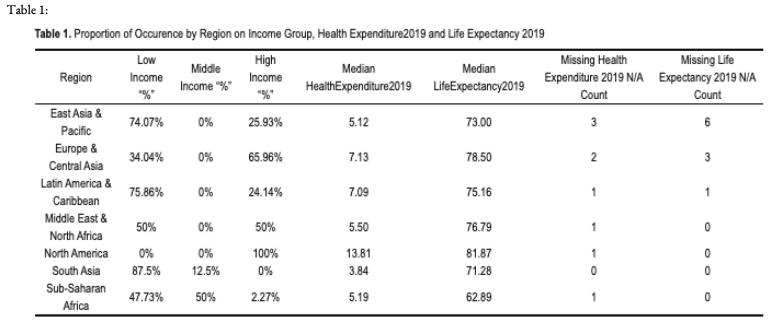
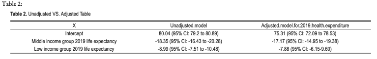
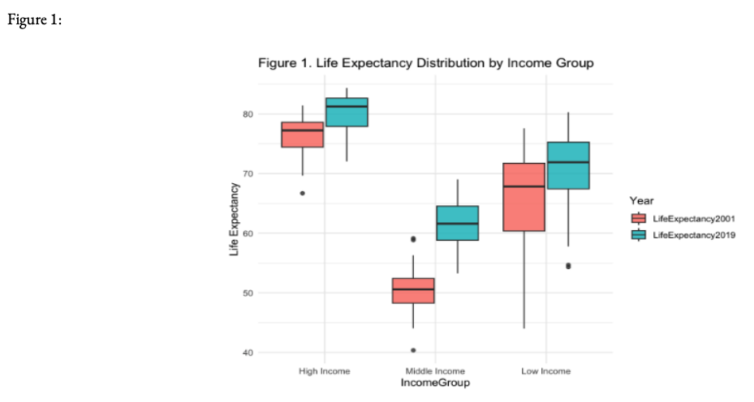

## Overview 

This class covered **multiple linear regression**, **analysis of covariance (ANCOVA)** and **one-way and two-way analysis of variance (ANOVA)**. Discussion was done on **model assumptions**, **interpretation**, **transformations**, **outlier detection**, **dummy variables** and **variable selection** procedures. Examples were drawn from biomedical literature and **R** was utilized for statistical analysis. 

---
## Data Analysis Plan for Life Expectancy 

Collaborators: 

This project utilized data from [World Bank Open Data](https://data.worldbank.org/) & [Our World in Data](https://ourworldindata.org/).  For this data analysis project, a subset of the data was used to focus on information available in years 2001 and 2019 and for a subset of variables from the [Kaggle website](https://www.kaggle.com/datasets/mjshri23/life-expectancy-and-socio-economic-world-bank).

 Using the data `BIOST512-subset-LifeExpectancy.csv`, importing, cleaning, creation of factor variables and analysis was done using **Rstudio** and the packages, `psych`, `rigr`, `lattice`, `tidyverse`,`kableExtra`, `ggplot2`, `ggthemes`.

**Key objectives**

This project investigated the **relationship** between **income, health expenditure and life expectancy** and how these factors **influenced life expectancy in 2019** with a focus on the role of a country's income and 2001 life expectancy. 

**Methods**

To understand the **key trends** and **relationships**, we started with a **descriptive analysis** by creating a mock table to track the proportion and occurrences for each factor based on income classification per region. This also included a review of **missing data** to identify **potential limitations**. A **box plot** provided a visual overview of life expectancy distributions in 2001 and 2019, broken down by income group.

To test **associations** between **income group** and **life expectancy** we used a **one-way analysis of variance (ANOVA)** test. We also used **analysis of covariance (ANCOVA)** to model the effects of income group, health expenditure and life expectancy in 2001 on life expectancy in 2019. Several **hypotheses** were tested to evaluate interactions such as the effect of health expenditure on life expectancy and whether 2001 life expectancy acted as an effect modifier in 2019. 

**Results**

In this project we found that the **median life expectancy** for 2019 was **82 years** for **high income** countries, **63 years** for **middle income countries** and **73 years** for **low income countries**. Despite some missing data (n=10) the statistical analysis indicated a **significant association** between **income group** and **life expectancy** (p < 0.001). When we **adjusted** for health expenditure there was **no significant interaction** between health expenditure and income group, which suggests that health expenditure does not act as an **effect modifier** in this context.

However, when we included 2001 life expectancy in the model, there was a **significant interaction** which confirms that previous life expectancy serves as an **important modifier** of life expectancy outcomes in 2019.

**Conclusion** 

This project confirms that **income group** is a **significant determinant** of **life expectancy in 2019**. Adjusting for health expenditure did not change the results and including 2001 life expectancy revealed its role as a critical factor influencing life expectancy trends. Further research could expand on this analysis with longitudinal studies, qualitative inquiries, cross-country comparisons and exploration of policy implications. 

[Download Full Project Report (PDF)](dap2.pdf)

[GitHub Code Repository](https://github.com/smwhikeh/biost512)
