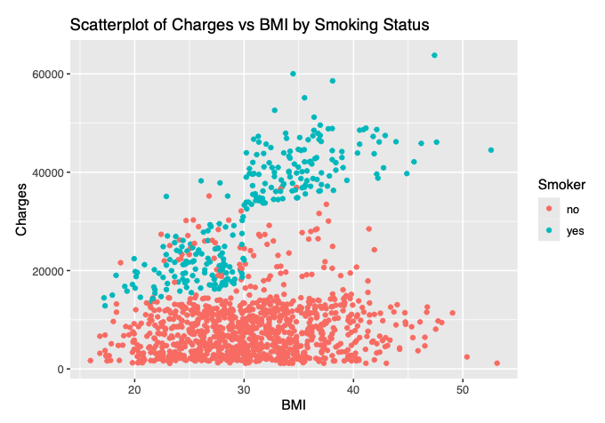
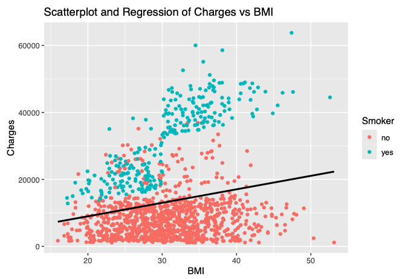
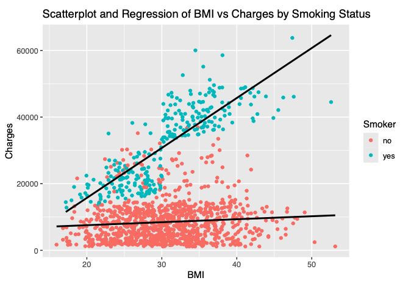
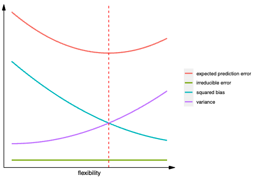
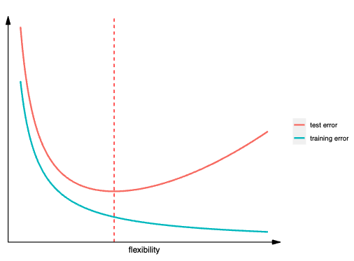

## Overview

This course provided an introduction to **statistical machine learning** methods for the analysis of biomedical data. It covered **high dimensional regression** and **classification methods**, **variable selection techniques**, **clustering** and **dimension reduction** methods. 

Through this course I was able to gain a better understanding of **supervised** and **unsupervised** machine learning models, characterize **bias variance trade-off**, understand connections between **machine learning approaches** and **classical statistical techniques**, translate scientific problems in **statistical models** that can be estimated using machine learning methods, select model's **hyper parameters** to **minimize generalization error** (ex - out of sample error) and apply **R** in variety of machine learning techniques (ex - **lasso and ridge regression**, **splines**, **generalized linear models**, and **neural nets**).

---

## Assignment #1

This assignment analyzed **medical costs** billed by health insurance and focused on the **impact of BMI and smoking status** using **regression modeling**. It explored the **bias-variance trade-off** through **conceptual visualizations** and **numerical simulations**. 

### Medical Cost Analysis 

**Data Preprocessing** 

- Using the `Medical_Cost_2.RData`, I loaded in the dataset and checked for missing values.
- Removed missing data using `na.omit()`

**Exploratory Data Analysis**

- Created a scatter plot of `bmi (x-axis)` vs `charges (y-axis)` with color coding to distinguish smokers and non-smokers 

**Regression Modeling**

1. **Least-Squares Linear Models**
    - `Model 1: charges ~ bmi`
    - `Model 2: charges ~ bmi + smoker`
    - `Model 3: charges ~ bmi * smoker` (interaction term included)

- Reported estimated **regression coefficients** and **interpretation**
- Computed **95% CI** for `bmi` coefficient and provided interpretation 
- Plotted **regression lines** on **scatter plot** 
- Calculated **mean squared error (MSE)** for each model 
- **Predicted** medical costs for smokers with `bmi = 29` and `bmi = 31.5`
- **Computed and predicted** cost differences between smokers and non-smokers 

2. **Interaction Model with New Variable**

- Created `smoker_bmi30p` a boolean variable for smokers with `bmi > 30`
- Fit a linear model incorporating `bmi`, `smoker`, and `smoker_bmi30p`
- Presented **estimated coefficients** and assessed statistical significance 
- Discussed **implications** of **non-significant variables** and their effect on the scatter plot
- Compared **cost differences** using this model vs the previous approach 

### Bias-Variance Trade-off Analysis 

**Conceptual Analysis**

- **Plot** showing squared bias, variance, irreducible error and expected prediction error as functions of model flexibility 
- Illustrated training and test errors across varying model complexity levels 

**Numerical Simulations** 

- Explored **bias-variance tradeoff** through numerical simulations. Investigated how model complexity affects bias and variance in regression. 

1. Data Generation 

    - Generated `X` using `rnorm()` and noise $\varepsilon$ using `runif()`
    - Defined true response function 

- **Predictor Variable (X):** A vector of length \( n = 30 \) generated using `rnorm()`.
- **Noise (ε):** A vector of length \( n = 30 \) generated using `runif()`.
- **Response Variable (Y):** Defined as:
  
  \[
  Y = f_{true}(X) + \epsilon
  \]
  

  where the true function is:

  \[
  f_{true}(X) = 3 + 2X + 3X^3
  \]

2. Model Fitting  

Fit the response variable \( Y \) using **linear regression** with different polynomial representations:

- **Linear Model:**  
  \[
  f(X) = \beta_0 + \beta_1 X
  \]

- **Quadratic Model:**  
  \[
  f(X) = \beta_0 + \beta_1 X + \beta_2 X^2
  \]

- **Quartic Model:**  
  \[
  f(X) = \beta_0 + \beta_1 X + \beta_2 X^2 + \beta_3 X^3 + \beta_4 X^4
  \]

- **Cubic-Only Model:**  
  \[
  f(X) = \beta_0 + \beta_1 X + \beta_3 X^3
  \]

3. Model Evaluation  

**Training Error Analysis**  
For each model, computed the **training mean squared error (MSE)** and analyze how model complexity impacts in-sample performance.

**Test Error Analysis**  
- Generated **10,000 new test observations** using the same data generation process.  
- Evaluated the fitted models on this test set by computing the **test MSE**.  
- Comparison of training vs. test MSE reveals insights into **overfitting vs. underfitting**.

**Comparison to True Model**  
- Computed the **true regression function's MSE** on both training and test data.
- Compared the MSEs of the fitted models against the true function to assess bias and variance.

### Conclusion

This assignment provided **insights** into medical cost data production using **regression modeling** and highlighted the balance between **model complexity** and **predictive accuracy** through **bias-variance trade-off**. 

[Download Full Assignment Report (PDF)](hw1.pdf)

[GitHub Code Repository](https://github.com/smwhikeh/biost_546)

---